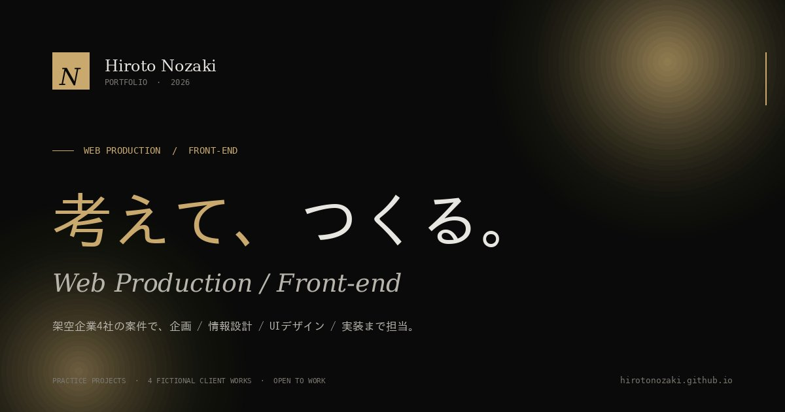
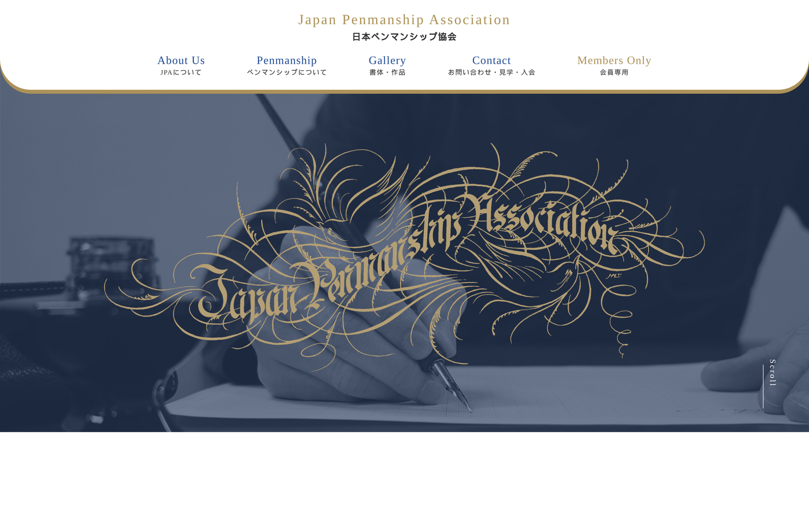

[README.md](https://github.com/user-attachments/files/28432651/README.md)
<div align="center">

# Hiroto Nozaki — Portfolio

**伝わる順番を、設計する。** ／ Web Production・Front-end

野崎大翔（Hiroto Nozaki）のポートフォリオハブサイト。
**公開・運用中の実案件「日本ペンマンシップ協会」公式サイト**を主軸に、
自主制作4本（焼肉 黒耀／NOVA TECH CAREERS／NEXUS Inc./NOIR MEN'S CLINIC）の
Live Site・ソースコード・企画書 PDF への玄関として機能します。「焼肉 黒耀」は React / TypeScript で再構築した発展版（React Edition）も収録しています。

<br />

[**🌐 Live Site**](https://hirotonozaki.github.io/hiroto-nozaki-portfolio/) ・ [**📁 Repository**](https://github.com/hirotonozaki/hiroto-nozaki-portfolio) ・ [**📄 Case Study（JPA）**](https://hirotonozaki.github.io/hiroto-nozaki-portfolio/jpa-case.html)

<br />


</div>

<br />

## 📖 Overview ／ 概要

採用ご担当者様に最短経路で全作品を見渡していただくための「玄関」として制作したハブサイトです。**3分でポートフォリオ全体を把握できる構造**を最優先に設計しました。トップの Works では、まず**公開・運用中の実案件**を「PICK UP」として大きく掲げ、各リソース（公開サイト・GitHub・Case Study・企画書 PDF）への導線を1画面に集約しています。

| Item | Detail |
| :--- | :--- |
| **Project Type** | ポートフォリオハブサイト |
| **Structure** | シングルページ（縦動線1枚）＋ ケーススタディページ |
| **Works** | 実案件1本（公開・運用中）＋ 自主制作4本 ＋ React Edition（作品①の発展版） |
| **Role** | 企画 / 情報設計 / デザイン / 実装 |
| **Stack** | HTML5 / CSS3 / Vanilla JavaScript |
| **Hosting** | GitHub Pages |

<br />

## ⭐ Featured ／ 実案件：日本ペンマンシップ協会 公式サイト

英字書法・装飾文字のアート「ペンマンシップ」を普及する協会の**公開・運用中のコーポレートサイト**です。協会の依頼をもとに、**課題整理・情報設計・画面設計・デザイン調整・実装・検証**までを一人で一貫して担当しました。「専門性は保ちながら、初めての人にも迷わず伝わる構造」を軸に、全13ページを設計・実装しています。

- 🌐 **公開サイト**：https://japanpenmanship.org/
- 📁 **GitHub（ソースコード）**：https://github.com/hirotonozaki/jpa-website
- 📄 **Case Study（本サイト内）**：[`jpa-case.html`](https://hirotonozaki.github.io/hiroto-nozaki-portfolio/jpa-case.html)
- 📑 **制作レポート（企画書 PDF・全21ページ）**：[`assets/pdf/jpa-report.pdf`](./assets/pdf/jpa-report.pdf)

| 項目 | 内容 |
| :--- | :--- |
| **クライアント** | 日本ペンマンシップ協会 |
| **種別** | コーポレートサイト（公開・運用中） |
| **担当範囲** | 課題整理 / 情報設計 / 画面設計 / デザイン調整 / 実装 / 検証（全工程・一人） |
| **規模** | 全13ページ ／ 使用画像 108点 ／ 制作期間 約15日 |
| **技術** | HTML5 / CSS3（reset + common・BEMライク命名） / JavaScript / jQuery（slick） |
| **計測** | Lighthouse — Performance 92 / Accessibility 96 / Best Practices 100 / SEO 100 |

> **評価の流れ**：① Works で作品を見る → ② Case Study で全工程を俯瞰 → ③ 企画書 PDF で各工程の詳細・図版・実装コード・検証結果を確認 → ④ GitHub でソースコードを確認、という順で深掘りできる導線を用意しています。

<br />

## ⚛️ React Edition ／ 焼肉 黒耀 React Reservation Experience

作品①「焼肉 黒耀」を、保守性・再利用性・チーム開発を見据えて **React + TypeScript + Vite + SCSS Modules** で再構築した発展版です。Works セクションのカードから、詳細モーダルで設計意図をご覧いただけます。

- 🌐 **公開URL**：https://hirotonozaki.github.io/yakiniku-kokuyou-react/
- 📁 **GitHub**：https://github.com/hirotonozaki/yakiniku-kokuyou-react

| 観点 | Vanilla JS 版 | React 版 |
| :--- | :--- | :--- |
| 状態管理 | DOM ＋ グローバル変数 | `useState` / Context で一元化 |
| 画面更新 | 手動 DOM 操作 | 状態変更で自動再描画 |
| スタイル | グローバル CSS | SCSS Modules でスコープ化 |
| 再利用 | コピー | コンポーネント化（`CourseCard` 等を共用） |
| 型安全 | なし（実行時に発覚） | TypeScript で事前検知 |

**なぜ React 化したか**：予約は状態が増えるほど DOM 操作が複雑化する。状態を変えるだけで UI が追従する React なら、手動更新のバグを根本から減らせるため。

**実務で意識した改善**：責務でのフォルダ分割、コンポーネントの再利用（`CourseCard`）、型による安全性、予約 UI の段階提示と進捗の可視化。

<br />

## 🌐 Live Site ／ サイトURL

| 種別 | URL |
| :--- | :--- |
| **本サイト（ハブ）** | https://hirotonozaki.github.io/hiroto-nozaki-portfolio/ |
| **⭐ 実案件｜日本ペンマンシップ協会** | https://japanpenmanship.org/ （公開・運用中） |
| └ Case Study | https://hirotonozaki.github.io/hiroto-nozaki-portfolio/jpa-case.html |
| └ GitHub | https://github.com/hirotonozaki/jpa-website |
| 作品①｜焼肉 黒耀 | https://hirotonozaki.github.io/yakiniku-kokuyou/ |
| 作品①+｜焼肉 黒耀 React Edition | https://hirotonozaki.github.io/yakiniku-kokuyou-react/ |
| 作品②｜NOVA TECH CAREERS | https://hirotonozaki.github.io/nova-tech-careers/ |
| 作品③｜NEXUS Inc. | https://hirotonozaki.github.io/nexus-corporate/ |
| 作品④｜NOIR MEN'S CLINIC | _In Development — WordPress Theme · Local Environment_（ローカル環境で開発中。`assets/pdf/noir-mens-clinic-proposal.pdf` と `assets/images/noir-mockup.svg` ／ `noir-wp-structure.svg` をご参照ください） |

<br />

## 💻 GitHub ／ リポジトリ

| リポジトリ | URL |
| :--- | :--- |
| **本サイト（ハブ）** | https://github.com/hirotonozaki/hiroto-nozaki-portfolio |
| **実案件｜日本ペンマンシップ協会** | https://github.com/hirotonozaki/jpa-website |

<br />

## 🛠 Tech Stack ／ 使用技術

| 領域 | 技術 |
| :--- | :--- |
| **Markup** | HTML5（セマンティック構造、JSON-LD (Person)、OGP / Twitter Card） |
| **Styling** | CSS3 / CSS Variables（FLOCSS 命名、`clamp()` で可変余白） |
| **Interaction** | Vanilla JavaScript（IIFE / IntersectionObserver / `requestAnimationFrame`） |
| **React Edition** | React 18 / TypeScript / Vite / SCSS Modules / React Router（作品①の発展版） |
| **Typography** | Fraunces（見出し）／ Noto Sans JP（本文）／ JetBrains Mono（数値・タグ） |
| **Hosting** | GitHub Pages |

<br />

## 💡 Concept ／ 制作意図

**Apple 風ミニマル × 制作会社らしい品位 × 編集デザインの読ませる文体** を一つの方向に統合することを試みました。

採用担当者は限られた時間で多くのポートフォリオを見ます。だからこそ「全作品を見渡せる玄関」を1枚に集約し、**公開・運用中の実案件を最初に提示**したうえで、各作品への導線（Live・GitHub・Case Study・企画書）を最短距離で配置することを設計の起点に置きました。

| 領域 | 方針 |
| :--- | :--- |
| **Color** | 漆黒 `#0a0a0a` をベースに、極小面積のシャンパンゴールド `#c9a96e` をアクセントに限定使用 |
| **Spacing** | セクション間 `clamp(96px, 12vw, 160px)`。Apple 並みの呼吸感を確保 |
| **Motion** | フェード＋Y軸 20px 移動のみ。`cubic-bezier(0.16, 1, 0.3, 1)` で統一 |

<br />

## ✨ Highlights ／ 工夫した点

### 1. 情報設計 — 実案件を起点に、3分で全体像が掴める縦動線
ファーストビュー → Works（実案件 PICK UP → 自主制作4作品） → 制作者情報、の順で配置。スクロール一本で全リソースに到達でき、深掘りしたい人だけが Case Study → 企画書 PDF → GitHub と段階的に進める「情報の段階的開示」を意識しました。

### 2. ケーススタディページ — 工程の言語化
実案件「日本ペンマンシップ協会」については、概要・課題と解決策・制作フロー・工夫した点・使用技術・レスポンシブ検証・制作レポートダイジェスト・成果物リンクを1ページにまとめた `jpa-case.html` を用意。各ダイジェストには制作レポート（PDF）の該当ページ番号を明記し、裏付けをたどれるようにしています。

### 3. CSS 設計 — 変数 + FLOCSS による保守性
配色・余白・タイポを `:root` に集約し、命名規則を FLOCSS（`l-` `c-` `p-` `u-`）に統一。複数人が触っても破綻しにくい設計です。

### 4. アクセシビリティ — 「品位」として扱う
`aria-expanded` / `aria-controls`、Escキーでの閉じ動作、`:focus-visible`、`prefers-reduced-motion` まで省略せず実装しました。

### 5. パフォーマンス — 必要十分な軽量化
OGP 画像は最適化済み PNG、Google Fonts は `preconnect`、`<noscript>` フォールバックを配置。ビルド不要のバニラ構成で初期表示を最適化しています。

<br />

## 📂 Directory ／ ディレクトリ構成

```
hiroto-nozaki-portfolio/
├── index.html              # ハブページ（縦動線1枚）／ Works 先頭に実案件 PICK UP
├── jpa-case.html           # ⭐ 実案件 日本ペンマンシップ協会 ケーススタディ
├── README.md
├── css/
│   └── style.css
├── js/
│   └── script.js
└── assets/
    ├── images/
    │   ├── ogp.png             # 1200×630 OGP/Twitter Card
    │   ├── noir-mockup.svg     # NOIR MEN'S CLINIC デザインモックアップ
    │   ├── noir-wp-structure.svg
    │   └── jpa/                # 実案件スクリーンショット（実サイトより取得）
    │       ├── jpa-hero.png        # トップ メインビジュアル
    │       ├── jpa-pc-full.png     # PC 全体
    │       ├── jpa-tablet.png      # タブレット
    │       └── jpa-sp.png          # スマートフォン
    └── pdf/
        ├── resume.pdf          # 履歴書（個人情報マスク版）
        ├── jpa-report.pdf      # ⭐ 日本ペンマンシップ協会 制作レポート（全21ページ）
        ├── yakiniku-kokuyou-proposal.pdf
        ├── nova-tech-careers-proposal.pdf
        ├── nexus-proposal.pdf
        └── noir-mens-clinic-proposal.pdf
```

<br />

## 🖼 Screenshot ／ スクリーンショット



実案件のメインビジュアル：



<br />

## 📱 Responsive ／ レスポンシブ対応

モバイルファーストで設計し、4つのブレイクポイントで動作を確認しています。

| Device | Width | 主な変化 |
| :--- | :--- | :--- |
| 📱 Mobile (S) | ~ 480px | 1カラム / タッチターゲット 44px+ |
| 📱 Mobile (L) | ~ 768px | 1カラム / 見出しサイズ最適化 |
| 📱 Tablet | ~ 1024px | 2カラム / ナビ表示切替 |
| 💻 Desktop | 1340px ~ | フル表示 / グローバルナビ |

<br />

## 👤 Author ／ 制作者情報

| 項目 | 内容 |
| :--- | :--- |
| **Name** | 野崎大翔（Hiroto Nozaki） |
| **Role** | Web Production / Front-end |
| **Currently Learning** | Next.js / Tailwind CSS / Vitest（テスト） / CI・デプロイ自動化 |
| **GitHub** | [github.com/hirotonozaki](https://github.com/hirotonozaki) |
| **Portfolio** | [hirotonozaki.github.io/hiroto-nozaki-portfolio](https://hirotonozaki.github.io/hiroto-nozaki-portfolio/) |

<br />

<div align="center">

<sub>「日本ペンマンシップ協会」は実在する公開・運用中の制作実績です。その他の制作物（焼肉 黒耀／NOVA TECH CAREERS／NEXUS Inc./NOIR MEN'S CLINIC）は、企画・設計力を示すための架空企業を題材とした自主制作です。</sub>

<sub>© 2027 Hiroto Nozaki</sub>

</div>
